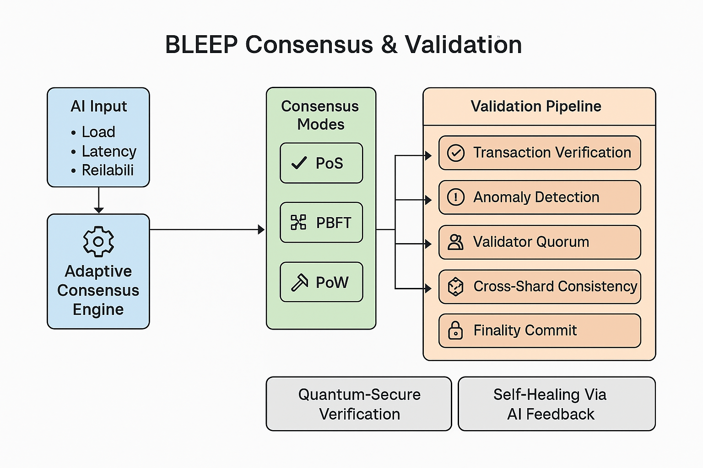

# BLEEP Adaptive Consensus System

The BLEEP blockchain features an advanced **AI-powered adaptive consensus** mechanism that dynamically switches between Proof of Stake (PoS), Practical Byzantine Fault Tolerance (PBFT), and Proof of Work (PoW) based on real-time network conditions.

## Key Components

- **Consensus Modes**:
  - `PoS` — Efficient, reputation-weighted consensus.
  - `PBFT` — High-trust, fault-tolerant validation.
  - `PoW` — Secure fallback for unstable conditions.

- **Validators**: Entities participating in consensus, each with:
  - Reputation
  - Latency
  - Stake
  - Activity status

- **AI Engine**:
  - Monitors real-time metrics
  - Predicts optimal consensus strategy
  - Penalizes malicious or underperforming validators

- **Networking Layer**:
  - Measures load, latency, and hashrate
  - Facilitates proposals and voting

## AI Consensus Mode Prediction

The AI engine uses historical and live metrics such as:
- Network load (%)
- Average validator latency (ms)
- Blockchain reliability score (0.0 - 1.0)

To select the most appropriate consensus method.

| Reliability | Chosen Consensus Mode |
|------------|------------------------|
| < 0.6      | PoW (secure fallback)  |
| 0.6–0.8    | PBFT (balanced)        |
| > 0.8      | PoS (efficient)        |

## Visual Architecture

## AI Logic Flow

1. Collect metrics
2. Predict best consensus using k-NN
3. Adjust validator scores
4. Switch consensus mode if necessary
5. Execute consensus logic

## Validator Monitoring

The AI engine also detects validator anomalies based on behavior patterns, staking irregularities, and latency changes.

Malicious validators are automatically penalized or disabled.

## Security & Resilience

- **Post-quantum signatures**: via SPHINCS+ for forward security
- **Fallback protocols**: Auto-recovery to PoW in extreme instability
- **Decentralized governance**: Validators influence upgrades

---

© BLEEP Blockchain — Quantum Secure | AI-Native | Self-Amending 
